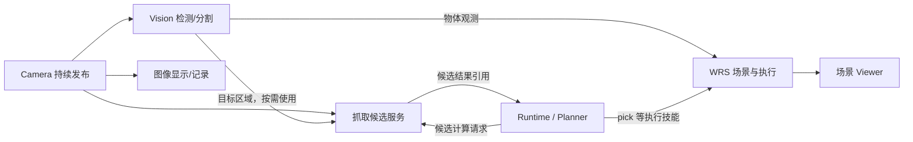

# WRS 状态、场景与并行感知

## 当前实现与本次范围

2026-09-22 已核对固定 WRS 源码，统一 TCP 字段并实现 SceneData 快照、静态物体配置和独立 viewer。相机、视觉/抓取候选节点与在线观测融合仍为后续设计；本轮没有接入真实抓放，也没有改变 Runtime 的任务/权限协议。

WRS 源码为 third_party/wrs，提交 2bb014b747833c2fd9345115fbe26ffb11376f20。它提供机器人、TCP、场景几何、碰撞及抓取等库能力；wrs 节点是本项目使用其中能力建立的工作场景与机器人执行服务，并不自动暴露整个库。

## 和 WRS 对齐的状态名称

| 当前字段 | WRS 对应接口 | 含义 |
|---|---|---|
| kinematics.qs | robot.qs | 当前 UR7E 六个关节值，单位 rad |
| kinematics.tcp_name | robot.tcp("flange").name | 报告的是哪个工具坐标系；当前裸 UR7E 使用 flange |
| kinematics.tcp_pos | robot.tcp(name).pos | TCP 在 world 中的位置，单位 m |
| kinematics.tcp_rotmat | robot.tcp(name).rotmat | TCP 在 world 中的 3×3 旋转矩阵 |
| kinematics.frame_id | 本项目消息元数据 | 上述位置和朝向用哪个坐标系表达；当前固定 world |
| data.robot.pose | 本项目命名姿态标签 | home/B/C 或 None，不是 WRS 的几何 pos |

旧 joints / tip_position 已移除，服务、客户端与 viewer 应同步更新并重启；不提供将连杆末端偷偷当成 TCP 的兼容字段。NodeSnapshot 外层的启动实例、控制版本和执行状态保留，消息封装与 Zenoh v4 路径未变；本次运动学数据字段是不兼容的 API 变更。

旧实现直接读取 gl_lnk_tfarr[-1]，对当时零工具偏移的 Lite6 与 flange TCP 恰好相同。新实现读取具名 TCP 的 tf，同一个快照同时取位置和朝向；相对移动的目标、IK 与到位检查都使用同一 TCP。这样加工具偏移时，计算的仍是工具点。TCP 名称回答“机器人上的哪个点”，frame_id 回答“坐标是相对于哪里”，两者不能互相替代。

## SceneData 作为 snapshot().data 返回

同步连接使用 snapshot = system.snapshot()，异步连接使用 snapshot = await system.snapshot()。机器人节点（Mock 和 WRS）统一返回：

~~~python
snapshot.boot_id                  # 本次节点启动
snapshot.state_version            # 既有执行状态版本
snapshot.data.frame_id            # "world"
snapshot.data.robot.pose          # "home" / "B" / "C" / None
snapshot.data.robot.kinematics    # WRS 关节与 TCP；Mock 为 None
snapshot.data.objects["A"].pos
snapshot.data.objects["A"].rotmat
snapshot.data.objects["A"].geometry.xyz_lengths
~~~

外层仍是 NodeSnapshot，保留 captured_at_ns、boot_id、control_epoch、admission、active_action、stop_confirmed。查询快照不会申请动作权限，也不会触发相机采集或重新运行模型。它是本节点保存的最新场景的一份独立副本；各对象/机器人观测可能来自不同时间，不能声称全场景同一时刻实测。

data.kind 从 robot 改为 scene，RobotData 收入 data.robot；objects 和场景 facts 放在 data。Mock 物体名称映射迁移为 objects[id].location；没有几何位姿时 pos/rotmat/geometry 保持 None，不捏造坐标。SpeechData 保持原结构。旧字段无别名，服务、客户端和 viewer 必须一起更新重启；Zenoh v4 路径及控制合同未变。

### 可运行的静态场景

System.launch(backend="wrs", scene=path) 与同步 launch 接受场景 TOML；直接节点 CLI 支持 --scene。路径相对调用者工作目录解释，示例使用 __file__ 构造明确位置；不指定时只有机器人。仅 WRS 后端接受该参数，非法配置在启动子进程前报错。

[scene.toml](../examples/wrs/scene.toml) 配置工作台和方块，[08_scene.py](../examples/wrs/08_scene.py) 独立启动、读取并退出。[05_start_node.py](../examples/wrs/05_start_node.py) 加载同一配置，[07_viewer.py](../examples/wrs/07_viewer.py) 读取服务快照显示机器人和物体。几何创建/读取在 WRS 所属工作线程，viewer 建立独立显示对象；它的关闭和对象更新不控制远端机器人。

首个几何类型为 box，字段 pos、rotmat、xyz_lengths 与固定 WRS 一致，另有 label、rgb、source、observed_at_ns、valid。物体 ID 是 objects 字典键，不重复保存。旋转矩阵检查有限值、正交和右手性，尺寸必须为正；允许缺少位姿/几何，viewer 不显示无法定位或无效的物体。物体上限 32，场景文件与消息大小均有界，保留已有 64 KiB 传输限制。

本地文件来源固定为 configuration，observed_at_ns 为 None，不能冒充视觉采集结果。当前物体在启动时加载，修改配置需重启服务；还没有在线物体编辑、感知融合或跨坐标系转换接口。WRS 内部确实持有 Scene 与 SceneObject，但本轮未进行碰撞规划或真实抓取，facts.collision_checked 为 False，pick/place 在 WRS 能力中仍明确不支持。几何显示不能作为运动安全保证。

## SceneData 需要哪些元数据

整个工作场景使用 SceneData，内部包含机器人和类型化物体。它是普通可传输数据；WRS 的 Scene/SceneObject 留在适配器内部。将来视觉模型输出观测，由 WRS 接受经过检查的几何更新并保存来源，不将预测直接当成物理事实。Mock 技能内部仍使用简洁的符号位置，快照映射为 ObjectData.location，缓存和恢复检查也读取该字段及 valid。

frame_id 有具体用途。例如相机前方 0.3 m 与机器人基座前方 0.3 m 不是同一地点。进入场景的位姿必须能说明坐标归属和所用标定；统一转换到 world 的 SceneData 可在外层声明一次，避免每个物体重复。原始相机图像/点云/观测保留其 frame_id、采集时间及标定关联。frame_id 是坐标系名称，不是图像编号；图像另有 frame_seq/observation_id。

暂不增加独立的 scene_revision。当前已有 NodeSnapshot.state_version，用于执行状态与动作上下文检查；它会随动作/状态推进，不能当作单独的几何版本。重复 snapshot 查询不改变该版本。只有实际消费者需要区分旧候选/新几何时才设计精确版本合同。初期可在 WRS 接受影响执行的几何变化时更新既有状态版本；收到新帧、刷新时间戳不等于几何变化。未来高频观测若需要细分，可让候选引用 observation_id、object_id、对象几何版本和标定版本，而不是再加一个无人使用的全局计数器。目标、相关障碍物或标定变化时要重算/重新验证，不能为避免频繁失效取消现有执行检查。

对象仍需稳定编号、可选位姿/几何、来源、采集时间与有效性。看不到不代表已经移除，未知朝向不能填单位矩阵冒充已知。不同来源观测的汇总不是同一时刻的全场景真值。

## Node 常驻，Skill 按需执行

Node 管理进程、设备、模型与缓存的生命周期；Skill 描述可调用的能力。一个常驻节点可以提供多项技能，两者不是二选一，也无需每个技能都新建进程。

| 组件 | 常驻时做什么 | 按需提供什么 |
|---|---|---|
| Camera 节点 | 独占打开相机，持续发布 RGB/深度/标定 | 取一份新鲜且配对的观测 |
| Vision 节点 | 模型加载一次，按自身频率消费图像 | 检测/分割/定位指定目标 |
| 抓取候选节点（可选独立 GPU 进程） | 模型加载一次，保存有限输入/结果 | infer_grasps，返回候选编号、抓姿、评分及观测依据 |
| WRS 节点 | 管理机器人与接受后的场景状态 | pick/place/move 等实际执行技能；目前真实 pick/place 尚未完成 |
| Viewer | 独立消费状态 | 显示机器人、物体、观测或候选 |

pick 是实际抓取技能，应由拥有机器人执行权限的 WRS 节点提供；infer_grasps 是候选计算能力，可由常驻模型节点提供。只有实际 GPU、依赖冲突、部署或故障隔离需要时才拆进程。常驻不代表每帧都重跑所有模型；可持续更新必要检测，对重计算按需请求。慢计算用有界工作队列，不能堵塞控制循环；取消候选计算也不等于设备已经停止。

## 并行订阅，不建设一条全局串行流水线

每个消费者独立订阅。相机不等待 YOLO，Viewer 不等待 GraspNet；某次抓取依赖一份分割结果时，只等待那次任务所需的结果。候选计算和新帧检测可以与机器人已有动作并行，最终执行仍由同一机器人入口检查。共享一块 GPU 时需限制任务并发与显存使用，进程并行不保证推理同时运行或低延迟。

图像、深度、mask、点云走直接数据流，不经 Agent 中转，也不嵌入每次 SceneData 快照。当前 Transport 是有 64 KiB 上限的 JSON 合同；真实相机接入必须增加明确的二进制消息或受控数据引用与有效期，不能把图像转大列表或简单放开控制消息大小。继续使用 Zenoh；同机共享内存只在测量后有必要时引入。

连续显示/检测允许各自丢旧保新，处理中的任务持有明确的输入版本。RGB、深度、分割结果必须按采集编号/时间和标定配对，不能各取“最新”后拼错帧。输入线程不直接操作 asyncio.Queue，不逐帧无限创建 Task。执行/停止请求保持可靠、幂等且有结果查询，不使用图像的丢帧策略。

## DimOS 相机数据流的实际做法

审计本地固定提交 29dfda595892dffb91c79f379eb44d1c737f9caf，而非只看示意图或较旧文档：

- [CameraModule](https://github.com/dimensionalOS/dimos/blob/29dfda595892dffb91c79f379eb44d1c737f9caf/dimos/hardware/sensors/camera/module.py) 把 hardware.image_stream() 接到 color_image.publish；另外发布 camera_info 和 tf，其他模块各自订阅。
- [Detection2DModule](https://github.com/dimensionalOS/dimos/blob/29dfda595892dffb91c79f379eb44d1c737f9caf/dimos/perception/detection/module2D.py) 订阅 color_image，通过 max_freq/清晰帧筛选和 backpressure 控制处理，再发布检测结果。
- [backpressure](https://github.com/dimensionalOS/dimos/blob/29dfda595892dffb91c79f379eb44d1c737f9caf/dimos/utils/reactive.py) 为订阅者安排异步处理；忙时保留最新待处理消息。流接口另有 [hot_latest/get_next](https://github.com/dimensionalOS/dimos/blob/29dfda595892dffb91c79f379eb44d1c737f9caf/dimos/core/stream.py)。
- [ObserveSkill](https://github.com/dimensionalOS/dimos/blob/29dfda595892dffb91c79f379eb44d1c737f9caf/dimos/agents/skills/observe_skill.py) 自己订阅 color_image，调用时 get_next 等待下一帧并有超时；它并非每次启动相机或检测模型。
- [传输说明](https://github.com/dimensionalOS/dimos/blob/29dfda595892dffb91c79f379eb44d1c737f9caf/docs/usage/transports/index.md) 区分图像/点云与 Agent 通道的拥塞处理。具体分布式部署由所选 transport 与进程布局决定，不是所有模块天然各占一台机器。

本项目借鉴持续发布、独立订阅、常驻能力和数据/控制分离。无需复制 DimOS 的完整 Module/Blueprint/RxPY 体系，也不照搬其逐消息线程实现。尚未完成的第一步仍应是一个有界、可查询新鲜度的真实相机发布/订阅切片，再接入具体视觉或抓取技能。
