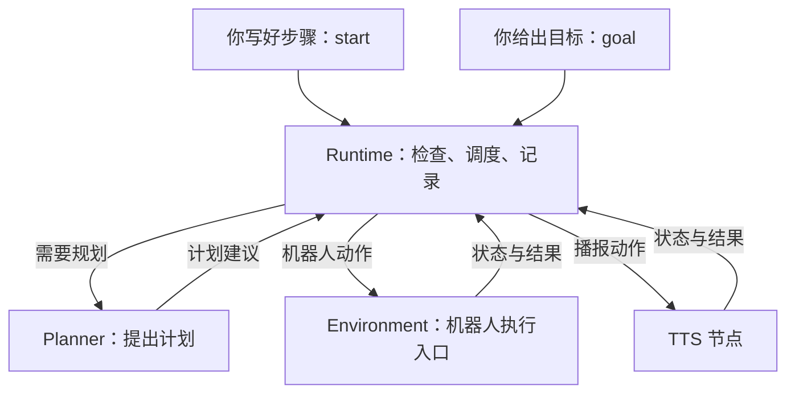
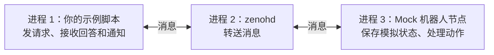

# 从一个动作开始，读懂 WRS-Agent

假设你想让机器人做一件事：**把 A 放到 B，操作时告诉我进度。**

这句话里其实有几件不同的工作：想清楚步骤、执行抓取和放置、播报进度、检查最后有没有放对。如果中途说“别说了”，你可能只想关闭播报；如果说“停一下”，则需要停止机器人。

WRS-Agent 就是把这些工作接起来的程序。你可以直接写 Python 指定动作，也可以把目标交给规划器，让它提出步骤。系统负责安排执行、记录进度和处理停止。

这篇文档从一个动作开始，逐步走到一个完整任务。只需要会读普通 Python，不需要先学异步编程、通信协议或模型 SDK。前面的例子都使用 **Mock**：用程序里的状态模拟机器人和播报，不连接实机，也不会真的发出声音。

## 1. 先让机器人做一件小事

先不考虑抓取，让模拟机器人移动到一个叫 `B` 的预设姿态。

所有命令都在仓库根目录的 PowerShell 中运行。已有运行环境可以直接运行示例；首次准备环境时，先按 [README](../README.md) 安装项目依赖和本地通信程序：

```powershell
./scripts/bootstrap.ps1
./scripts/install_router.ps1
```

`scripts/run.ps1` 会使用项目指定的 `D:\code\venv312\.venv\Scripts\python.exe` 和本地依赖。接下来运行 [第一个例子](../examples/beginner/01_action.py)：

```powershell
./scripts/run.ps1 examples/beginner/01_action.py
```

它的核心只有几行：

```python
from wrs_agent import launch

with launch() as system:
    action = system.action("move_named_pose", pose="B")
    print("当前状态", action.status().state)
    result = action.wait()
    print("执行结果", result.state, result.verification)
    print("机器人位置", system.snapshot().data.pose)
```

先理解三件事就够了。

`launch()` 把本机所需的程序启动起来，等它们准备好。进入 `with` 后可以发命令，离开时会清理它启动的进程。启动本身不会给机器人安排任务。

`action()` 提交一次动作。返回的 `action` 可以理解为这次操作的“查询单”：用它查进度、等待结果或请求取消。拿到查询单只说明动作已被接收，机器人可能还在执行。

`wait()` 等这次动作有最终结果。正常情况下，这个例子输出 `SUCCEEDED`、`PASS`，位置为 `B`。第一次查询可能看到 `ACCEPTED` 或 `RUNNING`，不必要求每次输出完全相同。

`SUCCEEDED` 表示动作成功，`PASS` 表示相应的结果检查通过。这里检查的是 Mock 状态；真实抓取还需要真实的持物或位置证据。并且，**等到结束也可能是失败或取消**，使用结果时仍要看状态。

## 2. 技能是“会做什么”，动作是“这次做什么”

刚才的 `move_named_pose` 是一个**技能（Skill）**：系统知道怎样移动到命名姿态。`pose="B"` 是这次调用的参数。把两者合起来提交，就产生了一个**动作（Action）**。

同一个技能可以调用很多次，每次动作都有自己的编号和结果。比如“移动到 B”和“移动到 home”用的是同一个技能，却是两次动作。

想知道当前能做什么，不必先翻源码：

```python
from wrs_agent import launch

with launch() as system:
    for skill in system.skills("播报"):
        print(skill.name, skill.description)
```

这是 [技能查询例子](../examples/beginner/02_skills.py) 中的用法。它按关键词和别名找候选，并检查当前执行程序有没有所需能力；不会调用模型，也不会执行查到的技能。

谁来做这些事？系统里持续运行、负责一类工作的程序叫**节点（Node）**。当前本地启动会准备四个节点：

| 节点 | 负责的事情 |
|---|---|
| Agent | 协调任务，决定哪些步骤现在可以开始 |
| WRS | 执行机器人动作，保存机器人状态，处理停止 |
| TTS | 执行播报；当前使用无声的 Mock 实现 |
| Voice | 接收已分类的交互事件，把查询或停止送到相应位置 |

一个节点可以提供多个技能。比如抓取、放置和移动都由机器人节点负责，播报由 TTS 节点负责。这个对应关系写在 [bindings.toml](../configs/bindings.toml) 中。节点分成多个进程后，播报和机器人动作就可以各自继续运行。

因此，多个节点不代表多个大模型。默认只设置一个规划器；执行节点按明确的规则完成自己的工作。

## 3. 把几个动作连成一个任务

现在回到“把 A 放到 B”。我们已经知道步骤，可以直接写出来：

```python
from wrs_agent import launch, step

with launch() as system:
    picked = step("pick", object="A")
    placed = step("place", object="A", target="B", after=picked)
    checked = step("verify", object="A", target="B", after=placed)

    task = system.start(
        step("speak", text="我正在处理。"),
        picked, placed, checked,
    )
    result = task.wait()
    print("任务结果", result.state)
```

`step()` 只是描述一步，创建它时还没有动作发生。`after=picked` 表示“抓取成功后，才能放置”。步骤都写好后，`start()` 才把整份计划交给系统。

这里又有两个概念：**计划（Plan）**是步骤和它们的先后关系；**任务（Task）**是这份确定计划的一次执行。同一份计划明天再做一遍，就是另一个任务。

上面的关系可以读成：

```text
抓取 A → 放到 B → 检查 A 是否在 B
播报“我正在处理。”（可以与抓取同时开始）
```

播报没有写 `after`，而且用的是另一份资源，所以可以和抓取同时开始。抓取和放置共用机械臂，则不能同时占用它。系统看的是**依赖关系和资源是否空闲**，不能只靠代码的书写顺序表达先后。

最后的 `verify` 是单独检查目标有没有达成。前面的动作各自有结果检查，整个任务还需要确认“A 确实在 B”。Mock 中检查的是模拟物体位置，目前真实 WRS 虚拟节点还不能执行这个抓取任务。

注意这几种查询的对象不同：

| 写法 | 查询或等待什么 |
|---|---|
| `action.status()` / `action.wait()` | `system.action()` 返回的那一次动作 |
| `task.status()` / `task.wait()` | 这项固定 ID 的任务 |
| `system.status()` | Runtime 当前总览 |
| `system.snapshot()` | 机器人现在的状态，例如姿态、持物情况 |

直接调用 `system.action()` 会把动作送到执行节点，不经过 Agent 的多步任务调度。要等它完成，就使用返回的 `action.wait()`。

## 4. 这份计划在系统里怎样走

刚才我们亲自写好了计划，因此不需要模型。负责接手这份计划的是 **Runtime**，也就是 Agent 节点里持续管理任务的代码。

Runtime 先检查计划是否合法、执行节点是否具备能力，再安排可以开始的步骤。执行期间，它记录哪些动作还在运行、哪些已经成功；依赖满足后才发出后续动作。如果状态无法确认，就不能把它当作成功继续往下做。

机器人这边的执行接口叫 **Environment**。它负责机器人状态、动作接收、执行和停止，是机器人动作的唯一入口。默认背后是 Mock；切换配置后，可以使用 WRS 虚拟模型。WRS 是底层机器人库，Environment 把它接到本项目统一的动作接口上。

如果只给一个目标、不写步骤，就需要 **Planner（规划器）** 提出计划。这三者的分工可以这样记：

- Planner：根据目标和当前情况，提出怎么做。
- Runtime：检查并安排这份计划，跟踪任务做到哪里。
- Environment：接收允许执行的机器人动作，执行并报告结果。



Planner 内部通过 **ModelClient（模型客户端）** 与模型服务通信。前者负责规划输入和决策，后者负责某家服务的请求与响应。所以更换模型服务，通常只需要改客户端适配；机器人技能不需要跟着修改。

这些独立进程通过 **Zenoh** 传消息。本地启动时会启动一个 router，你可以把它理解为消息转送程序。消息送到了，并不代表动作成功；执行结果仍由节点和 Runtime 判断。

通信可以按用途理解成三种：

| 用途 | 在这个任务中的例子 |
|---|---|
| Event / Stream：把发生的事发出来 | 发布动作进度，让订阅者收到更新 |
| Query：问一次，答一次 | 查询机器人当前状态 |
| Action：提交一项需要时间的工作 | 先接收抓取请求，之后报告进度和最终结果 |

Action 在实现上也使用请求和事件，但它还要保存动作编号、进度、结果和取消状态。即使漏掉一次完成通知，也能按原编号查询。Agent 负责协调任务，其他节点之间需要的消息可以直接传递。

## 5. 做到一半，怎么查询和停止

运行 [并行与停止例子](../examples/tasks/01_parallel_and_stop.py)：

```powershell
./scripts/run.ps1 examples/tasks/01_parallel_and_stop.py
```

它先让抓取和播报一起开始，再依次演示三种交互：

| 交互 | 示例调用 | 发生什么 |
|---|---|---|
| “做到哪一步了？” | `system.send_text("做到哪一步了")` | 查询任务状态，动作继续 |
| “别说了。” | `system.send_text("停止播报")` | Voice 直接请求取消 TTS，机械臂继续 |
| “停一下。” | `system.send_text("停止")` | Voice 请求 Runtime 取消当前任务，并检查停止反馈 |

`send_text()` 输入已经识别好的文字，由 Voice 本地规则分类。例子没有麦克风，也没有实际语音识别。单纯检测到声音还不足以认定用户要求机器人停止。

这个例子还会检查查询和取消播报没有改变机器人的控制状态。最终输出包含 `Planner 调用 0`：我们写好的计划和这些明确的交互都不需要模型判断。

为什么让 Voice 使用独立控制入口？因为模型可能很慢，机器人动作也可能还没完成。来自本机受信入口的停止请求需要自己的处理路径，不能排在“等模型回答”或“等普通动作结束”后面。

对一个直接提交的动作，也可以调用 `action.cancel()`。它返回的是取消处理的回执，还要通过 `action.wait()` 或 `action.status()` 确认结果。**请求停止和确认已经停止，是两件事。** 同样，`wait(timeout=...)` 超时只是脚本不再等待，动作可能还在运行。

普通同步脚本在 `wait()` 时会等在那里，但独立节点仍继续工作。如果应用需要在等待期间用同一个客户端处理交互，应使用已有的异步 `System.launch()` 入口；同步的 `system` 限当前线程使用。

## 6. 停下来以后，为什么不能直接接着跑

设想机器人原本要把 A 放到 B，你突然改口要放到 C。此时旧动作可能还在路上，旧的模型回答也可能刚刚返回。系统必须分得清：哪份计划已经失效，哪些结果还属于当前任务。

因此，一份确定计划的执行有自己的 `task_id`。取消确认后另行 start 建立新任务，用新编号；还在规划时则用 `request_id` 标识那一次请求。每个具体动作也有 `action_id`，重复收到相同动作请求时可以返回原状态，而不是再抓一次。

执行节点还记录“这是哪次启动”和“当前是哪一轮控制”。你会在代码中看到 `boot_id` 和 `control_epoch`：节点重启、停止撤销旧执行权之后，旧请求不能凭过去的状态继续运动。这些信息由系统管理，普通脚本不用手填，模型也不能自行授予权限。

任务使用 `cancel()` 后等待终态；再用 `start()` 新建任务。设备层 `allow_actions()` 只开放接收**新动作**的资格，不会续跑旧动作。接下来要根据当前状态重新安排工作。例如物体已经抓住，就不能假定它还放在桌上。

还有一种情况：请求发出后连接中断，不知道动作究竟有没有执行。这时状态是 `UNKNOWN`，意思是“还无法确认”。应该先按原动作编号查询和重新观察，不能换个编号盲目再做一次。想进一步了解旧动作如何失效、新任务如何接替，可以继续读 [中断后创建新任务的例子](../examples/developer/02_mock_interrupt.py)。

## 7. 从“自己写步骤”走到“只给目标”

前面使用 `start()` 指定步骤。另一种用法是 `goal()`：把目标交给 Runtime，由它尝试复用已有计划，或者请 Planner 提出新计划。

```python
from wrs_agent import launch

with launch() as system:
    planned = system.goal("put A in B").wait()
    if planned.task is not None:
        print("任务结果", planned.task.wait().state)
    else:
        print("规划结果", planned.state, planned.reason)
    print("规划调用次数", system.status()["planner_calls"])
```

这个例子仍然是离线的。默认 **Mock 模型是按规则返回计划的测试程序**，能识别少量严格的转移模板；明确的 home/回原位指令才会返回 home 计划，其他不支持的输入返回 CLARIFY，不执行动作。它不是任意自然语言理解器，不能拿它的表现判断真实模型能力。

在通用规划接口中，Planner 也可以回答问题或要求补充信息，不一定返回可执行计划。Runtime 只会让通过检查的计划进入执行。GLM 的请求与响应适配已有 [离线例子](../examples/developer/03_glm_adapter.py)，真实服务调用需要另行配置和验证。

熟悉的任务为什么还要每次重新问模型？这就是计划缓存要解决的问题。运行 [缓存例子](../examples/tasks/02_cache_reuse.py)：

```powershell
./scripts/run.ps1 examples/tasks/02_cache_reuse.py
```

它先把 A 放到 B，让前两次任务的起始条件保持一致，再执行四次目标：

| 次数 | 目标和条件 | 累计规划调用数 |
|---|---|---|
| 1 | A → B，首次规划，成功后保存可复用计划 | 1 |
| 2 | A → B，相关条件相同，复用计划 | 1 |
| 3 | 改成 A → C，需要重新规划 | 2 |
| 4 | 再做 A → B，但 A 已在 C，旧条件不匹配 | 3 |

当前缓存只复用条件严格匹配的转移模板。它保存的是“如何做”和“什么情况下能用”，不会保存一张永久有效的执行许可。每次复用仍要检查对象状态、技能和节点能力，并使用新的任务、动作编号及当前授权。

所以 `1 → 1 → 2 → 3` 同时展示了复用和拒绝复用。这里减少的是 Mock 规划调用，不是已测得的云服务费用或耗时。

## 8. 换成 WRS 虚拟模型，会有什么不同

Mock 适合先看懂任务和交互。接下来，[WRS 例子](../examples/tasks/03_wrs_scene.py) 用同一套 API 操作真实的 WRS Lite6 机器人模型：

```powershell
./scripts/run.ps1 examples/tasks/03_wrs_scene.py
./scripts/run.ps1 examples/tasks/03_wrs_scene.py --cancel
```

它把启动参数换成 `launch(backend="wrs_virtual")`。需要先具备 WRS 源码和科学计算依赖，环境条件见 [WRS 审计](WRS_AUDIT.md)。

这个例子没有图形窗口，而是在独立节点里计算关节运动和 **FK（正运动学：由关节角算出机器人姿态）**，输出进度和状态。正常模式移动到 B 后，再安排回 home；取消模式在运动中取消，确认结束后恢复接收资格，再新建回 home 的任务。

当前虚拟节点支持观察和命名姿态运动，抓取、放置、物体位置验证及碰撞规划仍不支持。它也不连接真实控制器。前面的 Mock 抓取任务不能只改一个启动参数，就变成已经验证的真实抓取。

<a id="developer-examples"></a>

## 9. developer：拆开看看系统怎么工作

前面的例子通过 `system.action()`、`system.start()` 使用系统。developer 里的三个例子把这些调用背后的过程展开：先看消息怎么送到节点，再看执行中出了变化怎么办，最后看模型怎么接进来。

第一个例子会先说明哪些是独立运行的程序、哪些只是脚本里的对象，再逐步解释代码。里面的 `async with` 和 `await` 会放在对应步骤中说明，末尾的 `asyncio.run(main())` 用来启动整个异步流程。

### 9.1 先让两个程序说上话：01_zenoh_roundtrip.py

先想一个很小的场景：你写的脚本想问机器人“你在哪里”，再请它“观察一次”。负责机器人状态的代码在另一个程序里，所以脚本需要把问题送过去，再把回答收回来。

这个例子做的就是这件事。`roundtrip` 是“往返”的意思：请求过去，回答回来。它还顺便演示两件事：动作进行时怎么发通知，以及没人回答时怎么结束等待。

#### 先看运行时有哪些东西

**进程就是一个正在运行的程序。** 运行这个 Python 示例，已经有一个进程了；示例还会启动两个配套程序，总共三个进程：



`zenohd` 是 Zenoh 的消息转送程序，也叫 router。这里三个进程都在你的电脑上，通过本机地址 `127.0.0.1` 联系。Mock 机器人也是一个真实运行的 Python 程序，只是它用内存里的状态模拟机器人，不会连接机械臂。

接下来代码中出现的 `stack`、`bus`、`client` 和两个订阅者，**都是第一个进程里的 Python 对象**。创建一个对象，不等于启动一个新进程。

<a id="local-stack"></a>

#### LocalStack 是帮你把这几个程序启动起来的工具

`LocalStack` 是本仓库在 [processes.py](../wrs_agent/processes.py) 中写的一个普通 Python 类。Local 表示“在当前电脑上启动和管理进程”，Stack 在这里指“一起运行的一组配套程序”。它把原本需要手动启动、连接、关闭的工作集中处理。

先看例子的第一行：

```python
async with LocalStack(bindings="configs/robot.toml") as stack:
```

可以把它读成：“准备好这次演示要用的本机程序，准备好之后叫它 `stack`，然后执行下面缩进的代码。”

进入 `async with` 时，它会依次做这些事：

1. 在本机启动 `zenohd`，准备消息通信。
2. 启动 Mock 机器人节点，为脚本建立通信连接，等节点能够正常回复。
3. 把已经准备好的对象交给变量 `stack`，才开始运行下面的代码。

离开这段缩进范围时，即使中途出了异常，也会关闭连接并清理它自己启动的进程。`async with` 在这里就是“准备好再进入，用完后清理”；`LocalStack(...)` 单独创建对象时还没有启动这些程序。

这里的 `configs/robot.toml` 只声明机器人节点；启动工具按 TOML 的 enabled 决定启动哪些节点，不再另设 agent/tts/voice 开关。机器人默认使用 Mock。本例只是问答和收通知，暂时用不到模型规划和播报。

前面的 `launch()` 其实也用了这个启动工具，关系是：

```text
launch() → System.launch() → LocalStack()
```

`launch()` 提供普通同步脚本用的 `action/start/goal` 等方法；`System.launch()` 提供异步写法的同一套操作；`LocalStack` 负责底下的程序启动和连接准备。这里直接使用它，是为了展开查看消息如何收发。

节点已经在运行时，使用 `connect()`（异步用 `System.connect()`）。它只建立连接，
退出不会关闭远端节点，也不会取消已接收的动作。`launch()` 和 `connect()` 得到的 system
使用同样的 action/skills/snapshot 方法。双程序运行步骤见 [连接示例](../examples/README.md#connect)。

#### 第一步：拿到通信工具，问机器人“你在哪里”

下面按源码顺序看。这里的代码片段是同一个 `main()` 中的部分，完整脚本的运行命令在本节末尾。

```python
client = stack.system.clients["wrs"]
bus = client.transport
snapshot = await client.snapshot()
print("2. 脚本问：你在哪里？机器人答：", snapshot.data.pose)
```

`stack.system.clients["wrs"]` 是已经配置好的机器人节点调用入口，不需要自己选择客户端类型。
WRS 和 TTS 在内部都使用同一种 `ActionClient`，它负责把 Python 调用变成节点的协议请求。
`client.snapshot()` 表示“向这个节点查询当前状态”，真正读取状态的是另一个进程。

`client.transport` 是这个入口使用的通信对象，此例取名为 `bus`，用来直接订阅动作通知。
只有这个讲协议的例子需要它；普通脚本使用 `system.action(...)` 和 `system.snapshot()` 即可。
机器人额外支持 hold/allow_actions，TTS 不支持；差别由节点提供的服务决定，不靠客户端继承区分。

这次调用实际走的是：

```text
脚本：client.snapshot()
  → bus 把状态查询送出去
  → zenohd 转交给机器人节点
  → 机器人读取自己的状态并回复
  → 回答沿原路回来，成为变量 snapshot
```

`await` 表示这段流程在这里等回复，等待期间可以让其他异步工作运行。`snapshot` 是**这一刻状态的副本**，里面的 `data.pose` 是机器人姿态名称。初始情况下会打印 `home`。这就是前文的 Query：一次请求，对应一次回复。

#### 第二步：先登记“有动作通知时，也发给我”

查询需要脚本主动问。另一种方式是机器人有新进展时主动发消息；想接收它，就先**订阅**，相当于登记自己关心哪类通知。

```python
subscriber_a = bus.subscribe("events/action", capacity=8)
subscriber_b = bus.subscribe("events/action", capacity=8)
```

这两行在当前脚本里建立了两个接收者。`events/action` 是“动作通知”这类消息的地址，不是磁盘目录。`capacity=8` 表示每个接收者最多暂存 8 条待取出的消息，避免一直积压。

为什么要两个？例如以后一个接收者负责显示进度，另一个负责写日志，它们都可能需要同一次动作的通知。本例先用两个简单的订阅者来验证这件事，没有真的启动界面或日志程序。

它们各收一份通知。**两个接收者不会让机器人执行两次动作。** 先登记、后发动作请求，是为了接住接下来发生的通知。

#### 第三步：请机器人“观察一次”

现在已经能通信，也有人准备收通知了。接下来提交一个最小的动作：

```python
context = await client.context()
action = await client.submit("observe", {}, context=context, task_id="roundtrip")
request, receipt = action.request, action.receipt
assert receipt.accepted
```

`observe` 是“观察一次”的技能。本例由 Mock 更新模拟观察状态，不需要机械臂运动，也没有相机输入。空字典 `{}` 表示这次技能没有额外参数。

这里展开了 `system.action(...)` 内部的两个调用：

- `context()` 向执行节点取得当前状态和短期执行凭证；提交时节点仍检查是否有效。
- `client.submit(...)` 内部构造 `ActionRequest`、生成 action_id，再通过 `bus.request()` 传输；返回可以查询和等待的动作句柄。这里手写的 task_id 是示例归属标签，不会创建 Agent 多步任务。

不再公开额外的请求组装函数。回复丢失时客户端查询同一个 action_id，不盲目重发。完整调用链、两个版本的区别和任务 cancel/start 用法见 [任务句柄说明](task_handles.md)。

#### 第四步：两个接收者分别拿到通知

机器人开始处理动作后，会向 `events/action` 发出通知。脚本再从两个接收者各取一条，确认它属于刚才提交的动作。

循环里这几行看起来长，其实只是“取消息、拆开、核对”：

```python
sample = subscriber.try_recv()
if sample is not None:
    payload = sample.payload.to_bytes()
    event = decode(payload)
    assert event["action_id"] == request.action_id
```

`try_recv()` 看一眼有没有收到消息。有就返回一条 `sample`，暂时没有就返回 `None`；`None` 不表示机器人失败。外围循环会稍等 0.01 秒再看，每个接收者的等待上限是 2 秒。

消息经过通信传输，正文是一串字节。`payload.to_bytes()` 取出这些字节，`decode(...)` 把 JSON 正文转成 Python 字典 `event`。这样就可以读取 `event["action_id"]` 和 `event["state"]`。

`action_id` 是动作编号：拿收到的编号和请求编号比较，能确认“这条通知说的正是我刚才提交的那次动作”。两个接收者都会做这个检查，并分别打印收到的动作状态，例如 `RUNNING`。

这两条通知证明两个接收者都收到了消息。它们不一定是最终结果；想确认动作是否成功结束，还要用 `client.status(request.action_id)` 查询。本例在这一段只检查通知送达。

#### 第五步：故意问一个不存在的服务

最后再试一种异常情况：“我发出问题，但没人负责回答，会怎样？”

```python
await bus.request("request/absent", {}, timeout=0.15)
```

`request/absent` 是故意写的服务地址，没有节点提供它。`timeout=0.15` 给这次请求一个有限的等待预算。未收到回复就产生 `TimeoutError`，脚本用 `try/except` 接住，打印“按预期结束等待”。

这里的超时是演示预期。随后脚本再请求实际存在的 `request/health`，收到机器人健康信息，说明正常问答还可以继续。`bus.request(...)` 直接使用消息地址；前面的 `client.snapshot()` 则把类似的请求包装成了更易读的方法。

#### 运行时把输出和上面的步骤对上

完整程序：[01_zenoh_roundtrip.py](../examples/developer/01_zenoh_roundtrip.py)。在仓库根目录运行：

```powershell
./scripts/run.ps1 examples/developer/01_zenoh_roundtrip.py
```

现在程序会逐步打印中文。下面摘取关键输出，动作编号每次不同，通知的状态也可能随运行时机变化：

```text
2. 脚本问：你在哪里？机器人答： home
3. 两个订阅者已登记，都准备接收机器人发出的动作通知。
4. 脚本请求：观察一次。机器人已接收，动作编号： <本次编号>
5. 订阅者 1 收到这次动作的通知：RUNNING
5. 订阅者 2 收到这次动作的通知：RUNNING
6. 故意查询不存在的服务：未收到回复，按预期结束等待。
7. 再查询机器人健康状态，仍能收到回复。下面输出检查汇总：
```

最后一行 JSON 是给检查程序看的汇总。`query: "PASS"` 表示问答正常；`pubsub_fanout: 2` 表示两个订阅者都收到通知；`timeout: true` 表示故意发往不存在服务的请求结束了等待。`health.backend: "mock"` 提醒我们，此处处理的是模拟机器人。

看懂这条过程后，再读 [通信实现](../wrs_agent/transport.py) 和 [动作客户端](../wrs_agent/nodes/actions.py)，就能把源码里的名字和实际职责对应起来了。


### 9.2 模型卡住、用户改口：02_mock_interrupt.py

消息能通之后，下一个问题是：**机器人正在干活，模型一直不回答，此时还能查询、停止，再改做另一件事吗？**

运行 [中断与新任务例子](../examples/developer/02_mock_interrupt.py)：

```powershell
./scripts/run.ps1 examples/developer/02_mock_interrupt.py
```

这次启动 Agent、Mock 机器人、Mock TTS 和 Voice。`deferred=True` 故意让 Mock 模型停在等待状态，后面再用测试入口放行。这样可以稳定地复现“模型回答来得太晚”，不需要真的等云端出故障。

整个故事按下面的顺序发生：

1. **先开始 A → B。** 脚本手写抓取、放置和验证计划，同时播报。等任务状态中同时出现两个活动动作，并确认播报已开始，再继续。
2. **制造一个挂起的规划请求。** 提交 `goal="next task"`，等规划调用计数变为 1。模型暂时不返回，原来的机器人任务继续运行。
3. **只取消播报，再查询机器人。** Voice 的 `barge_in` 直达 TTS。脚本等播报变为 `CANCELLED`，再等机器人已经持有 A 且仍有动作运行，发出查询，并确认查询没有改变机器人控制版本。
4. **停止原任务，保留已经发生的事实。** 调用原句柄的 `task.cancel()`，它携带原 task_id。收到受理回复后，用 `task.wait()` 等到 CANCELLED，并核对 `stop_confirmed`。这时 A 已经在手里，停止不会让抓取“倒带”，脚本检查仍持有 A。
5. **试着发送一条过期动作。** 脚本故意拿停止前的凭证，要求把 A 放到 B。即使换了新的 `action_id`，控制版本仍旧过期，因此节点拒绝并返回 `stale_epoch`。
6. **让旧模型回答姗姗来迟。** 调用仅供测试的 `request/test/planner/release`，放行之前挂起的模型。Runtime 将旧规划标为 `STALE`，表示它已经失效，不能再启动动作。
7. **按当前状态改放到 C。** 脚本手写剩余两步：“放到 C → 验证”。A 已在手中，所以不再抓取。旧任务已独立结束，再用 `system.start(*steps)` 创建新任务；脚本核对新旧 task_id 不同。

这里的 `wait_for(...)` 是一个小等待函数：反复查询，直到条件满足或超时。例如等到真正持有 A 后才发停止，能确保例子演示到了“持物停止”，而不是碰巧在抓取开始前就取消了。

正常输出中，可以这样对照刚才的过程：

| 字段 | 说明 |
|---|---|
| `tts_cancelled_only: true` | 取消播报后，机器人分支仍能继续 |
| `held_after_stop: "A"` | 停止确认后，仍保留持物状态 |
| `old_action_rejected: "stale_epoch"` | 停止前的旧执行凭证已失效 |
| `late_model: "rejected_before_new_task"` | 旧模型输出已被判定过期 |
| `new_task_has_new_id: true` | start 创建了另一个任务 |
| `final_task: "SUCCEEDED"`、`final_A_location: "C"` | 新任务完成，模拟物体 A 最后位于 C |

与 tasks 里的停止例子相比，这里还展示了**指定旧任务、等待停止确认、拒绝旧动作和旧模型输出、创建独立新任务**这一整段衔接。新的剩余计划是脚本写的，并没有让模型理解“改放到 C”。

代码里的 `control=True` 选择控制通道，权限仍由执行节点检查。这个例子验证的是本机 Mock 行为，不代表已经测得实机停止时间。想继续追踪执行流程，可以看 [Runtime](../wrs_agent/runtime.py)；想看交互怎样被送往不同节点，可以看 [Voice](../wrs_agent/nodes/voice.py)。

### 9.3 模型回复怎样成为计划：03_glm_adapter.py

前两个例子已经看过执行和控制，现在单独看模型这一端：**模型返回一段内容后，系统怎样知道它是在回答问题，还是提出一个可执行的计划？**

运行 [GLM 适配例子](../examples/developer/03_glm_adapter.py)：

```powershell
./scripts/run.ps1 examples/developer/03_glm_adapter.py --dry-run
```

默认不需要 API key。如果提示缺少 `httpx`，按提示执行 `./scripts/bootstrap.ps1 -Extra glm` 安装可选依赖后再运行。

这里的 **fixture（测试样本，也常叫夹具）** 是一份保存在仓库里的 [GLM 响应 JSON](../examples/fixtures/glm_tool_call.json)。`httpx.MockTransport` 用它代替 HTTP 服务的回复，因此请求构造和响应解析都会执行，但不会访问云端。修改 `--goal` 也不会让这个固定样本自动生成另一份答案。

顺着代码看，模型建议会经过这条路线：

```text
示例目标 + 手写的物体状态 + 技能说明
    → ModelPlanner 组织规划请求
    → GLMClient 构造请求、读取本地响应样本
    → 取出 propose_plan 的参数
    → ModelPlanner 校验为 PlanDecision
    → 打印计划建议
```

样本中的 `tool_calls` 可以理解成“模型提出了一次结构化调用建议”。这次建议的名字是 `propose_plan`，参数里写着“观察 → 抓取 A → 放到 B → 验证”。它的作用是把计划交给系统检查，没有直接调用机器人。

这里恰好能看到两层代码的分工：`GLMClient` 识别服务的响应格式，检查是否完整、是否是允许的工具；`ModelPlanner` 再解析工具参数，检查它是否符合计划的结构要求。例如只返回了半段内容、JSON 不完整或步骤依赖成环，都不能成为有效计划。真正执行时，Runtime 和执行节点还要检查当前能力、状态与权限。

运行后重点看这些字段：

| 字段 | 怎么理解 |
|---|---|
| `profile: "glm_offline_http_fixture"` | 此次使用本地响应样本 |
| `network: false` | 没有请求真实模型服务 |
| `dry_run: true`、`actions_submitted: 0` | 只展示建议，没有提交动作 |
| `decision.kind: "execute"` | 建议的类型是执行计划，尚未执行 |
| `decision.plan.steps` | 经过结构校验的四个步骤及其依赖 |

这个脚本没有启动 Zenoh 或执行节点。`--dry-run` 表示“不执行动作”；是否调用真实模型由另一个开关 `--live-model` 决定，两者不要混淆。真实服务的配置入口见 [README](../README.md)，这里先把离线路径读懂即可。

要理解如何更换模型服务，接着看 [GLMClient](../wrs_agent/planner/providers/glm.py)；要理解建议如何变成统一的决策，接着看 [ModelPlanner](../wrs_agent/planner/__init__.py)。非法模型建议被拒绝的情况由 [Planner 单元测试](../tests/unit/test_policy_planner.py) 和 [GLM 联调测试](../tests/integration/test_glm_runtime.py) 进一步覆盖，当前示例展示的是有效计划这条路径。


## 10. 接下来按自己的需要读

想先用起来，就沿着 [示例目录](../examples/README.md) 从 beginner 走到 tasks。需要研究通信、异常和模型接入时，跟着上一节逐个运行 developer 的例子，再进入对应源码。

想改代码，可以从你关心的问题进入：

| 你想弄清楚的事 | 阅读入口 |
|---|---|
| `launch/action/start/goal` 怎样工作 | [同步入口](../wrs_agent/sync.py)、[系统接口](../wrs_agent/system.py) |
| 怎样定义技能、绑定执行节点 | [技能库说明](../wrs_agent/skills/README.md)、[节点配置](../configs/bindings.toml) |
| 多步任务如何调度、取消和确认结束 | [Runtime](../wrs_agent/runtime.py) |
| 模型响应如何变成计划建议 | [Planner](../wrs_agent/planner/__init__.py) |
| 机器人动作具体怎样实现 | [Mock 环境](../wrs_agent/env/mock.py)、[WRS 环境](../wrs_agent/env/wrs.py) |

接口迁移和实现细节见 [API 记录](api_simplification.md)。要判断哪些能力已验证，再看 [验收记录](ACCEPTANCE.md)：Mock 行为、WRS 虚拟运动、真实模型、真实音频和实机是不同的验证范围。
